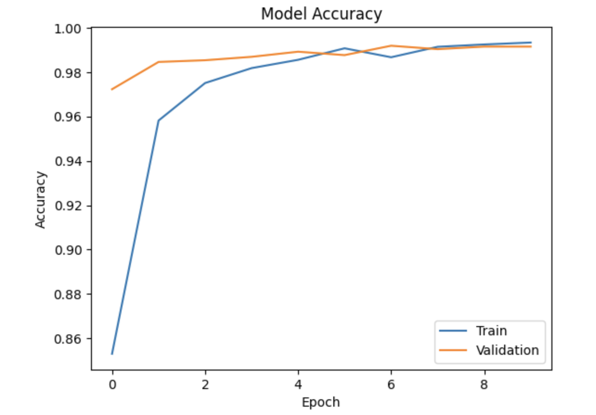
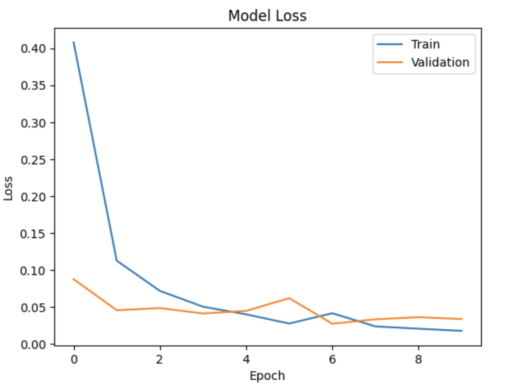
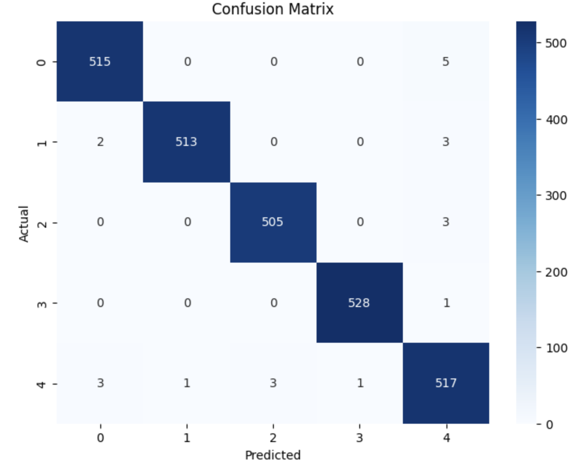
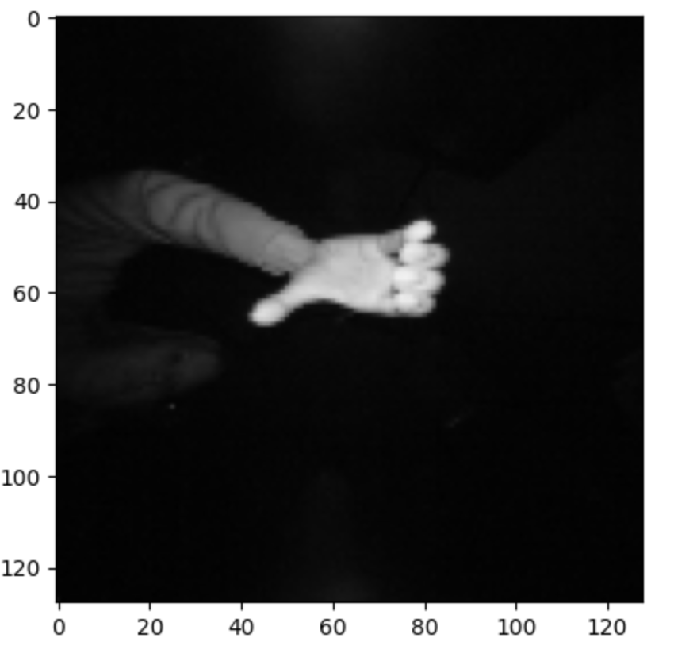

# Hand Gesture Recognition Using CNN

## Project Overview
This project implements a Convolutional Neural Network (CNN) to recognize hand gestures from images.

## Dataset
The dataset contains approximately 13,000 images divided into 5 classes:
- Backward
- Forward
- Left
- Right
- Unknown

## Technologies Used
- Python
- TensorFlow
- Keras
- NumPy
- Matplotlib
- Scikit-learn

## Model Performance
- Validation Accuracy: 99.15%
- Validation Loss: 0.0339

## Results

The model achieved excellent performance on the validation dataset.

### Accuracy Curve

### Loss Curve

### Confusion Matrix

### Sample Prediction

## Future Work
- Real-time webcam gesture recognition
- Mobile deployment
- Additional gesture classes

## Author
Mohammed Aiman Sadhik

